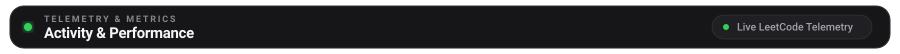

<!-- Hero Banner -->

<h1>PHI CONG THANH</h1>

<b>Backend Engineer • Scalable Architecture • High-Performance Systems</b>

<!-- Dynamic Animated Typing Terminal -->

<!-- Profile Links & Badges -->

  
  &nbsp;
  
  &nbsp;
  

<!-- Apple Precision Divider -->

<!-- Section: Education -->

  

<table align="center" width="100%">
  <tr>
    <td width="130" align="center" valign="middle">
      
    </td>
    <td valign="middle">
      <h3>🏛️ Ho Chi Minh City Open University (HCMCOU)</h3>
      

        • <b>Major:</b> Information Technology (Computer Science) 
        • <b>Academic Period:</b> 2025 – 2029 
        • <b>Career Track:</b> Backend Engineer (Distributed Systems, Database Architecture &amp; High-Performance Computing) 
        • <b>GPA:</b> 🔄 <i>In Progress / To Be Updated</i>
      

    </td>
  </tr>
</table>

<!-- Apple Precision Divider -->

  

<!-- Section: Skills -->

  

  

<table align="center" width="100%">
  <tr>
    <th align="center" width="25%" valign="top"> ☕ Core &amp; Backend</th>
    <th align="center" width="25%" valign="top"> 🗄️ Database Systems</th>
    <th align="center" width="25%" valign="top"> 🛠️ Tools &amp; Environment</th>
    <th align="center" width="25%" valign="top"> 🎨 3D &amp; Graphics</th>
  </tr>
  <tr>
    <td align="center" valign="top">
       
        
      
        
    </td>
    <td align="center" valign="top">
       
        
      
        
    </td>
    <td align="center" valign="top">
       
        
      
        
    </td>
    <td align="center" valign="top">
       
      
        
    </td>
  </tr>
</table>

<!-- Apple Precision Divider -->

  

<!-- Section: Activity -->

  

  

<!-- Apple Precision Divider -->

  

<!-- Section: Footer Quote -->

  

